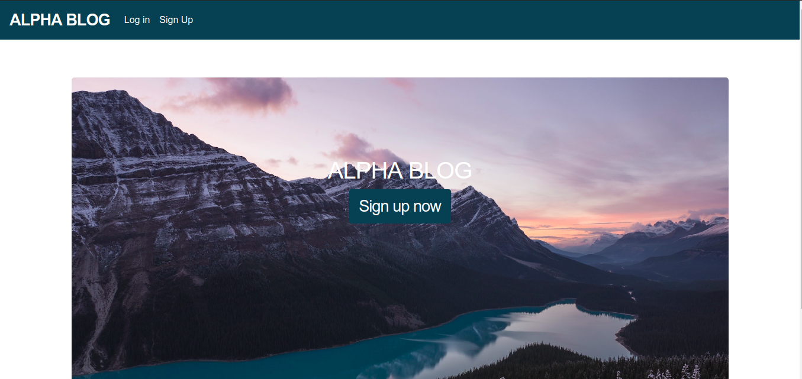

# Alpha Blog 
> ​  This is a blog built using rails.



Additional description about the project and its features.


## Built With

- HTML/CSS,
- Ruby on Rails

## Ruby version

- rbenv 2.6.3

## System dependencies

- Rails 6.0.2
- Yarn 1.19.1
- Ubuntu 18.04 and below


## Getting Started

To get a local copy up and running follow these simple example steps.

### Setup

Open your git bash and cd to the location you'd like to put your files the run the command below.

```console
https://github.com/damiecode/Alpha-Blog.git
```

## Installation


```
cd Alpha-Blog
bundle install
```

```
rails db:migrate
```

To start the server:```rails server```

## Author

👤 **Damilola Ale**

- Github: [@damiecode](https://github.com/damiecode)
- linkedin: [Damilola Ale](https://linkedin.com/in/damiecode/)

## Show your support

Give a ⭐️ if you like this project!
